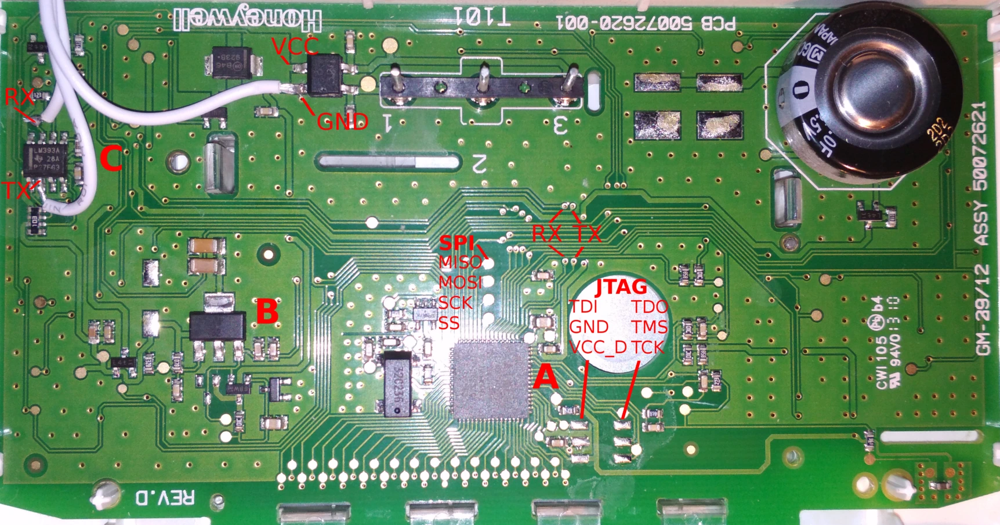
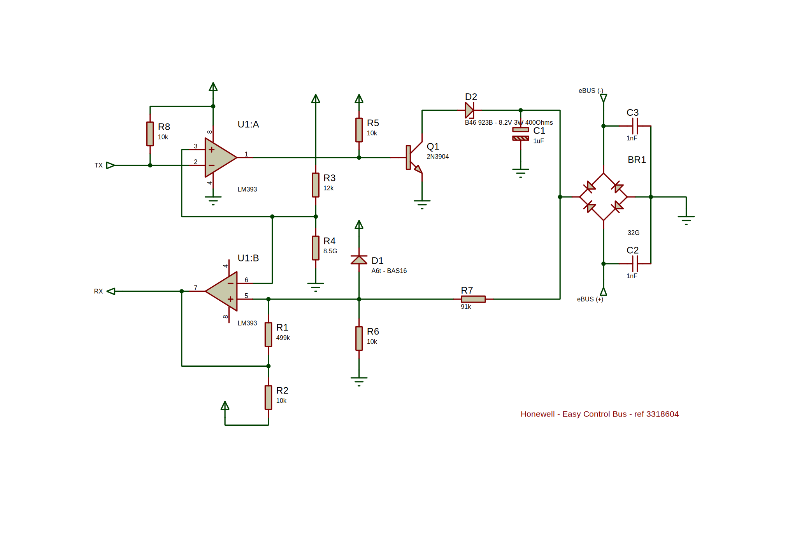

# Hardware reversing

About thermostat & temperature sensor.

## External temperature sensor

The official sensor is sell with the ref. 3318599 for ~50€.

Specifications:

    10 K +/- 1% β=3977
    Cable EBUS2*
    Max. 50m
    Min. 0,5 mm2

Yes, it's a 10kΩ at 25°C CTN thermistor...

It costs cents to 2€, but you can found them for nothing in lithium computer batteries for example.

Voltage measured at no load at the terminals of the boiler socket: 4.93V

Measurements with fixed resistors:

 Ohms  | Temp   | Voltage   | Current I = U/R
| :--- | :---   | :---      | :---
61.2K  | -14°C  | 4.68V     | 0,076 mA
44.3K  | -7°C   | ?         | ?
20.1k  | 8.6°C  | 4.16v     | 0,206 mA
14.68K | 16°C   | 3.94V     | 0,268 mA
9.84K  | 25 °C  | 3.6V      | 0,365 mA
7.48K  | 30°C   | ?         | ?
7.4K   | 31°C   | 3.3V      | 0,445 mA
4.66K  | 41°C   | 2.76V     | 0,592 mA
2K     | -      | 1.74V     | 0,87  mA
1.5K   | -      | -         | -

So the current is not constant, it's not a constant current generator ???

## Water compensation formulas

### Outdoor sensor only mode

Ohms | ext temp | theoric temp | measured temp | delta
:--- | :--- | :--- | :--- | :---
| 15K | 16.2 |    34.56°C |     35°C |        -0.44 (unreliable because water can't be set below 35°C)
|       | 8.6 |    43.68°C |     43.6°C |      0.08
|        | -7.6 |    63.12°C |     ? |
|48.5K |  -8.8 |    64.56 |       64.4 |        0.16
|51.85K |  -9.2 |    65.04 |       64.9 |        0.14
|69.5K |  -14.8 |   71.76 |       71.6 |        0.16

This gives the following formula:

`f(ext_temp) = (-slope*ext_temp+y-intercept) + zone_temp_offset`

With for example a slope of 1.2, the y-intercept is 54.

Available line attributes:

> **Note**
> y-intercept = slope*20°C + 30°C
> Since the heat stops at an external temp of 20°C, and the water temp target is always 30°C at this point.

slope | y-intercept
:--- | :---
0,2 | 34
0,4 | 38
0,6 | 42
0,8 | 46
1   | 50
1,2 | 54
1,5 | 60
2   | 70
2,5 | 80
3   | 90
3,5 | 100

### Room temp only

TODO, help is welcome

### Outdoor + Room sensors

TODO, help is welcome

## Thermostat

Here is a quick description of the thermostat "Easy Control Bus" sold by Chaffoteaux and
produced by Honeywell under the reference 3318604.
It's a ON/OFF thermostat, not an ambient probe but it uses eBUS to communicate with the boiler.

### PCB

The circuit is powered on via the eBUS wires.

Main components:

- A: Atmega 329 as the main mcu and LCD driver
- B: LDO unknown ref, 3.3V
- C: LM393A

The power supply is based on an LDO generating a voltage of 3.3V.
The LM393A voltage comparator is directly powered by this source.
The MCU ATMEGA 329 is powered by 2.95V when the EBUS power is cut via a 1F capacitor.

You might be tempted to connect a device such as an ESP12 to this circuit and feed it
with the LDO, unfortunately it seems to be designed only to provide a very low current.
The ESP with WiFi activated consumes 75mA on average.
The voltage instantly drops to ~1.5V which will cause glitches on the 2 devices
and incessant reboots of the boiler.

Warnings:

- On the image, an external 3.3V power supply is used for the ESP but the ground plane
**must be common** to the 2 devices.
- Such a connection will mute the thermostat; the TX pin of the ESP will have priority.
- You cannot receive what you are sending on the line. To sniff out what the thermostat
is sending you will need to put the RX pin of the ESP on the TX of the Atmega.

### eBUS circuit

All components related to the TX/RX lines are displayed.
Only capacitors values are unknown.

### Firmware

The firmware was flashed without protecting fuses. It's easy to dump it via the SPI interface.
*BUT* it will be very frustrating to study, because there is no debugging information.

BTW, the firmware dump is posted on the current directory [here](./flash+eeprom.bin.tar.gz).

Anyway an alternative firmware could be written from scratch.
