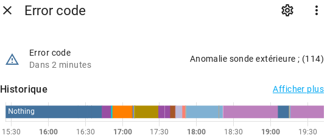
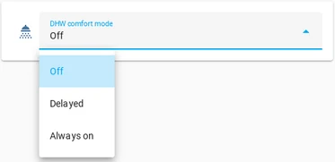

# How to install Home Assistant integration ?

The goal is to have a complete control of the device on solutions like Home Asssitant.I assume that you have a working installation of an MQTT server like Mosquitto
or have it installed as an addon to Home Assistant.

eBusd will take care of publishing most of the sensors with their respective read/write status.

Some bugs remain (04/2023):

- impossible to specify a range for a value other than the range deduced from its type 
  => fixed with specific yaml statements (see above)
- impossible to automatically represent multiple choice inputs (ex: thermoregulation type). 
  => fixed with specific yaml statements (see above) 
  => **update (jan. 2024)**: it's possible now with a recent version of ebusd that supports "options" attribute
  in the JSON payload sent to the MQTT server.
- hazardous naming of entities displayed in Home Assistant. 
  => essentially fixed by the `mqtt-hassio.cfg` file of this repository.

## Integration via MQTT Discovery

Command to enable MQTT integration of ebusd:

    ebusd -d 192.168.1.65:3333 --latency=200000 --configpath=/path_to_your_config_files/ --enablehex --receivetimeout=100 \
    --mqtthost 127.0.0.1 --mqttport 1883 --mqttuser=<mqtt_user> --mqttpass=<password> --mqttjson \
    --pollinterval=10 \
    --mqttint=/path_to_your_mqtt_config_file/mqtt-hassio.cfg

The default `.cfg` should be at `/etc/ebusd/mqtt-hassio.cfg`.

> **Note**
>
> Since I don't want to maintain it, it is not planned to publish my full version of the `mqtt-hassio.cfg` file.
>
> So **I only publish a patch** to apply to the file you have.
>
> To find out what this patch contains and the reason for the changes, I **strongly suggest** to study
> the commits of this repository with the tag `[ebusd_HA]`.

This file supports some specific rules created for this particular brand of boiler
(the filtering of the entities to be published on the MQTT server is based on regexes).

Grab the `mqtt-hassio.cfg` and `mqtt-hassio.cfg.patch` files and apply the following command:

    $ patch mqtt-hassio.cfg < mqtt-hassio.cfg.patch

To reverse the patch:

    $ patch --reverse mqtt-hassio.cfg < mqtt-hassio.cfg.patch

## Range (min/max/step) issues of MQTT Discovery

The ebusd daemon and its config file doesn't allow to set range & step values for an entity.
While the [MQTT Discovery function](https://www.home-assistant.io/integrations/mqtt/#mqtt-discovery)
feature would support these data we have to specify them separately in the home assistant config.
Without this, the range is deduced from the type of data (-32767;32767 for the SIN type).

**This is done** for most entities (generic and for the zone 1 of the boiler) in the file
`widgets_and_automations.yaml` of this repository, at the section `homeassistant/customize`.

## Error codes from the boiler

As you will see in the yaml file,
the integration uses a basic sensor that is updated with a human readable text via an automation.
HA doesn't allow you to modify the state of basic sensors, so you need to use the
[python_script integration](https://www.home-assistant.io/integrations/python_script/).

From here, an additional script is mandatory ;
`set_state.py` must be put in the `python_scripts/` directory of your HA installation.
The script is available here: <https://github.com/xannor/hass_py_set_state>.

Result:

## Specific widgets

For multiple choice inputs such as `z1_thermoreg_type` and `dhw_comfort_mode_status_w`,
you will need to add to the `~/.homeassistant/configuration.yaml` file (or in separate files to include)
the code proposed in the file `./home_assistant_integration/widgets_and_automations.yaml`.

Result:

